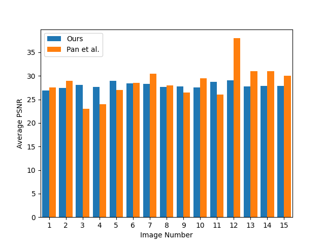
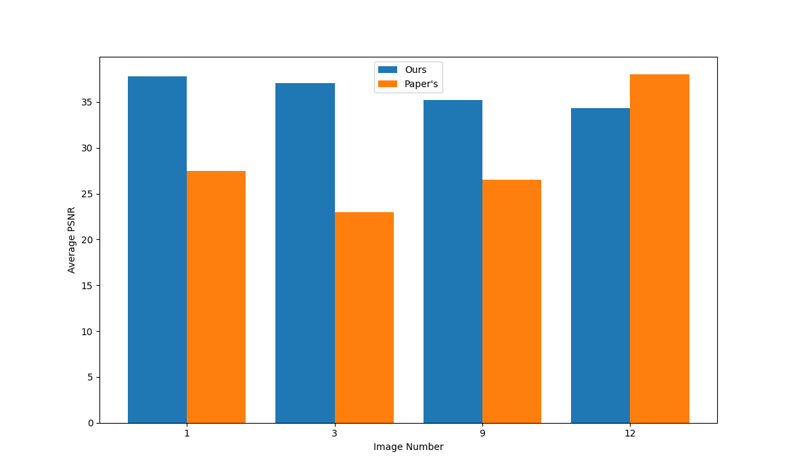

# deblur
This is an unofficial Python implementation of the 2014 IEEE paper "Deblurring Text Images via L0 Regularized Intensity and Gradient Prior" by [J. Pan, Z. Hu, Z. Su, and M. Yang](https://openaccess.thecvf.com/content_cvpr_2014/papers/Pan_Deblurring_Text_Images_2014_CVPR_paper.pdf)

We also provide extra functionality to deblur images with a [Kaggle Blur Dataset](https://www.kaggle.com/datasets/kwentar/blur-dataset?resource=download)


## Project info
This is implemented as the final project for CS1430 at Brown. 

Contributing members:

Alan Gu,

Edward Xing,

Luca Fonstad,

Paul Zhiyuan Zhou


## Setting up
```bash
python3 -m venv env
source env/bin/activate
pip3 install -r requirements.txt
```


## Running
deblur images
```python
python3 -m deblur.motion_deblur [--data ieee] [--save] [--regularizatio n] [--threshold]
# use either `ieee` or `kaggle` for the --data option to run different datasets to deblur
# use --save to save the deblurring results to disk
# use --regularization to change the regularization used for artifact removal
# use --threshold only on grayscale images to enhance results
```
run `python3 -m deblur.motion_deblur --help` for more information

evaluate the PSNR of deblurring results (this may take quite a while)
```python
python3 -m deblur.eval
```


## Results
We achieve comparable PSNR performance as the IEEE paper:


Furthermore, we also propose a image pixel intensity threshold method that achieves better PSNR results for grayscale text images:

use the `--threshold` option to run the `motion_deblur.py` to try it out!


## File structure
`data/`: the data directory

`assets/`: the assets directory holding images for README

`resources/`: data storage for artifacts removal functionality

`deblur/`: the source code directory, in which we have:

`conjugate_gradient.py`: our implementation of the conjugate gradient algorithm as an optimization scheme

`eval.py`: the script to evaluate results

`get_data.py`: data preprocessing and parsing

`motion_deblur.py`: the main magic and algorithms to deblur images

`params.py`: storage for hyperparameters

`visualize.py`: visualization methods